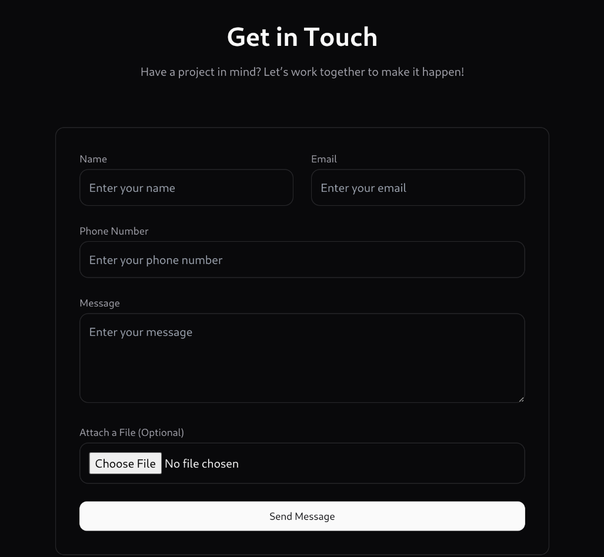
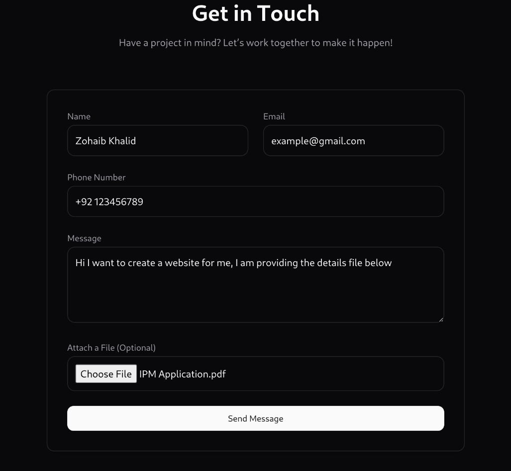
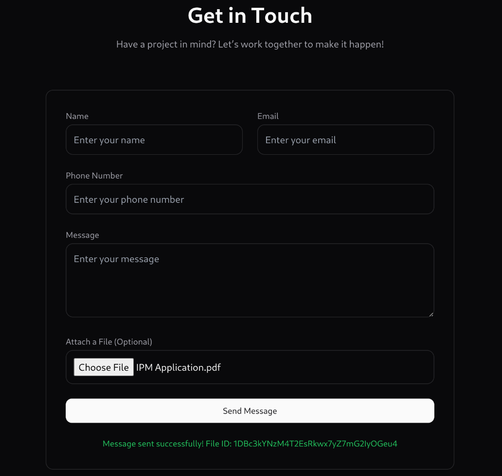
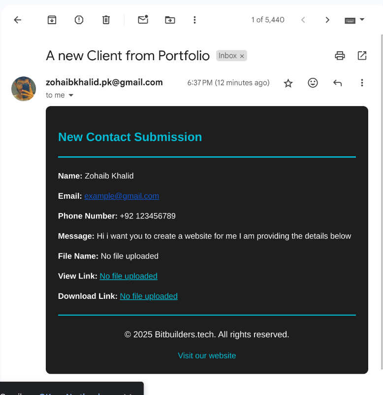

# 📬 Contact Form with File Upload, Google Drive Integration & Email Notifications

Welcome to the **Contact Form with File Upload, Google Drive Integration & Email Notifications** project! 🎉 This project allows users to submit their contact information, upload a file, and automatically save that file to Google Drive. Additionally, an email notification is sent to the user each time someone submits a message via the contact form.

---

## 🚀 How It Works

### 1. **Contact Form Submission** 📝
Users can submit their contact details (like name, email, and message) through a simple contact form. Once submitted, the data is securely processed and stored in a MongoDB database.

  


### 2. **File Upload** 📸
After submitting their details, users can upload a file (like a photo or document). The uploaded file is temporarily stored on the server.

  

### 3. **Successfull Upload** 📸
After submitting the form the file will be saved to google Drive and a success message will be shown to the user with the file id of google drive file

  


### 4. **Saving to Google Drive** 🌐
Once the file is uploaded, it is automatically saved to a designated folder in Google Drive. The folder ID can be easily configured in the `.env` file.

  
*(Leave space for the Google Drive screenshot)*

### 5. **Email Notification** 📧
After the file is successfully saved to Google Drive, an email notification is sent to the user, letting them know their file has been successfully uploaded.

  
*(Leave space for the email notification screenshot)*

---

## 🛠️ Setup Instructions

To get this project up and running locally, follow these steps:

### 1. Clone the repository:
```bash
git clone https://github.com/thezohaibkhalid/Contact-Form-Backend.git
cd Contact-Form-Backend
```

### 2. Install dependencies:
```bash
npm install
```

### 3. Configure your `.env` file:
Create a `.env` file in the root of the project and add the following environment variables:

```plaintext
# Required: The port your server will run on
PORT=5000

# Required: MongoDB connection string (replace with your actual connection string)
DB_CONNECT=mongodb+srv://<username>:<password>@<cluster>.mongodb.net/<dbname>?retryWrites=true&w=majority

# Optional: Folder ID for a specific folder in Google Drive
FOLDER_ID=<your_folder_id_here>

# Required: Google OAuth credentials for your app (replace with actual credentials)
CLIENT_ID=<your_google_client_id>
CLIENT_SECRET=<your_google_client_secret>

# Required: Google OAuth redirect URL
REDIRECT_URL=<your_google_redirect_url>

# Required: Google OAuth refresh token (generated during OAuth process)
REFRESH_TOKEN=<your_google_refresh_token>

# Required: Email configuration for notifications or communication
NOTIFICATION_EMAIL=<your_notification_email>

# Required: Email user and password for email service (ensure to secure these values)
EMAIL_USER=<your_email_address>
EMAIL_PASSWORD=<your_email_password>
```

### 4. Run the project:
Once the `.env` file is configured, start the server with the following command:

```bash
npm start
```

Your project should now be running on `http://localhost:5000`.

---

## 🎯 Features

- **Contact form** for users to submit their information.
- **File upload** functionality that allows users to upload files (photos, documents, etc.).
- **Google Drive integration** to automatically save uploaded files to a specific folder in Google Drive.
- **Email notifications** to inform users that their file has been successfully uploaded.

---

## ⚙️ Technologies Used

- **Node.js** for the backend server.
- **MongoDB** for storing contact form data.
- **Google Drive API, Google Cloud, Client ID, Client_SECTRET, O Auth 2.0 etc** for file uploads to Google Drive.
- **Nodemailer** for sending email notifications.

---

## 🤔 Troubleshooting

If you're running into issues or need assistance, check the following:

- **Error: "Google OAuth not working"**: Ensure that your `CLIENT_ID`, `CLIENT_SECRET`, and `REFRESH_TOKEN` are correct.
- **Error: "File not uploading to Google Drive"**: Check the `FOLDER_ID` in your `.env` file to ensure it's valid and accessible.
- **Error: "Email not sending"**: Verify that your `EMAIL_USER` and `EMAIL_PASSWORD` are correct, and that your email provider allows SMTP connections.

---

## 📝 License

This project is licensed under the MIT License - see the [LICENSE](LICENSE) file for details.

---

## 💬 Contact

If you have any questions or need further assistance, feel free to reach out on my Mail! 📬


- **Email**: [zohaibkhalid.pk@gmail.com](mailto:zohaibkhalid.pk@gmail.com)
- **GitHub**: [thezohaibkhalid](https://github.com/thezohaibkhalid)

---


